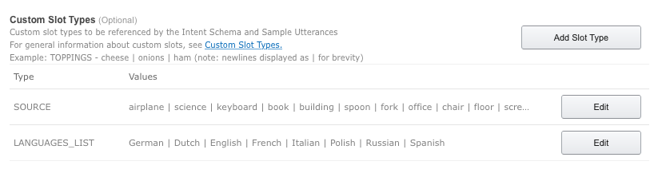

#Amazon Alexa API Project: Build Google Translate Skill

We just got our hands on the Amazon Echo - a new Alexa-powered voice assistant device from Amazon. Let's see what we can do with it.

The Amazon Alexa platform is based on **skills**. Skills are the equivilent of apps for this voice-powered platform. While there are countless skills we could potentially build for Alexa, today we'll focus on letting users translate words using the Google Translate API.

###This article will go through...

1. Adding the translation skill to Amazon Alexa
2. Creating the skill's backend in AWS Lambda
3. Connecting Alexa to the Google Translate API using RapidAPI

###What you'll need: 

* Amazon Echo device
* Amazon account

On that note, let the hacking begin!

##Step 1: Define the Skill's Elements
FYI, we'll be following Amazon's document [Steps to Build a Custom Skill](https://developer.amazon.com/public/solutions/alexa/alexa-skills-kit/overviews/steps-to-build-a-custom-skill).


###1a: Create the skill
Our new *Skill* will be a voice-powered tool for translating text. This skill means that the user will be able to ask Alexa to translate words or phrases from over 90 languages. For example, the user might say, *Alexa translate "butterfly" to German* and Alexa will respond by saying, *The word for "butterfly" in German is Schmetterling*. Pretty cool, right?

To get started, we'll head over to the [Amazon Developer Portal](https://developer.amazon.com) and login. Pro tip: the account you use to log in here should be the same account your device is configured with. That way, any skills that you build will sync to your Echo automatically.

Once logged in, head over to the Alexa tab and create a new Alexa skill. Call it `Translate` and set its language to English.


###1b. Define the intent
The next step will be to define the **intent** schema. Every skill in the Alexa platform is made of intents. An intent is basically an action that the user can perform with the skill. Our skill will have one intent - `Translate`. Thus, our definition will look like this:

```
{
	"intents": [
		{
			"intent" : "Translate",
			"slots": [
				{
					"name" : "Source",
					"type" : "SOURCE"
				},
				{
					"name" : "Language",
					"type" : "LANGUAGES_LIST"
				}
			]
		}
	]
}
```
###1c. Define the slots and slot types
As you can see, the intent has 2 **slots**. A slot is like a placeholder for a piece of data that the user can supply to the intent. The slots in our case will be:

- Source: the original word to be translated.
- Language: the language we want to translate it to.

Each of the slots has a **slot type** (SOURCE and LANGUAGES_LIST, respecively). These slot types define what information can go into the slot. You define slot types by providing examples of words that can go in the slot. For us, the slot types will look like this:



###1d. Define the utterances
The last part of the definition is the **utterrances**. An utterance is a example phrase that the user can say to invoke this specific intent. In other words, utterances are the data Alexa uses to recognize commands. Our utterances will be pretty basic:

```
Translate translate {Source} to {Language}
Translate ask Translate how to say {Source} in {Language}
Translate ask Translate to translate {Source} to {Language}
Translate get translation for {Source} in {Language}
Translate what is {Source} in {Language}
```

Now that we have the intent, its slots types and its utterrances set, we can move to configuring our amazon skill. The next step is to connect our new skill to a 'backend' that will actually perform the translation.

##Step 2: Connect to Amazon Lambda

AWS Lambda is a service that let's you write code that runs whenever an event (ex. an HTTP request or an AWS Alexa command) occurs. We will use Lambda in this tutorial so that we will not have to worry about setting up servers, load balancer etc.

Head over to [AWS](aws.amazon.com) and sign in to your console. In the console, head over to the Lambda service and create a new lambda function named `ALEXA-TRANSLATE-SKILL`. We will not use a blue print and will set the code to be uploaded in a zip file.

.

The code that we upload will be the code that runs every time we call an intent on Echo. For now we will just use the code from the directory `01`. Head over to the directory, compress it's files (make sure to compress the files and not the folder) and uplaod it to the Lambda page. For the role, just choose the template option.

All this code will do is Reply to the request by saying something like *Translating **butterfly** to **German***. It'll let us see that all the data is passed correctly.

The last step will be to connect the Alexa skill to the Lambda function. To do that, simply copy the function identifier of the Lambda function and paste it in the Skill settings (as shown bellow).


We have now gone through all the steps necessary to create a basic Alexa skill. In the Alexa developer portal, you can say / type inputs an see that output:


If you have an Amazon Alexa compatible device like the Amazon Echo, you can try the skill on it. If you used the same account while configuring it and creati g the skill, it'll show up on the Alexa app automatically under *Your skills*.

##Adding the translation functionality
While this is all very exciting, our skill doesn't actually do much yet... The next (and last step) will be to dig into the code and add the actual translation functionality.

We'll use [RapidAPI](https://rapidapi.com) to connect to the [Google Translate API](http://rapidapi.com/package/GoogleTranslate). If you haven't already, create a RapidAPI account. Create a new project on RapidAPI and get the API key.

Once you have the API key and project name at hand, go back to the `01` directory and install the RapidAPI SDK by running the following line in the command line:

	npm install rapidapi-connect --save

Once the SDK is installed, open the index.js file. This is the code run by the Lambda function to handle requests sent to the skill. At the top of the file, add the following lines to connect to RapidAPI:

	const RapidAPI = new require('rapidapi-connect');
	const rapid = new RapidAPI('PROJECT-NAME', 'API-KEY');

Replace `PROJECT-NAME` and `API-KEY` with your details.

Everytime the lambda function gets a request, it hits the `handle` function (last function in the code). If the type of the request is `IntentRequest` - meaning the user is trying to get the skill to perform an intent, it'll call the `onIntent` function. If the name of the intent is `Translate` (we defined this as the only valid intent in our skill), it'll call the `translate` function. That's the function we'll use to perform the translation.

Right now it calls the call back with a string containing the input and the language, we'll change the code to look like that:

```
function translate(intent, session, callback) {
    const GoogleAPIKey = '####GOOGLE_API_KEY#####';

    const langCodes = {
        "German" : "de",
        "Dutch" : "nl",
        "English" : "en",
        "French" : "fr",
        "Italian" : "it",
        "Polish" : "pl",
        "Russian" : "ru",
        "Spanish" : "es"
    };
    const source = intent.slots.Source.value;
    const lang = intent.slots.Language.value;
    const langCode = langCodes[lang];

    //Call RapidAPI
    rapid.call('GoogleTranslate', 'translateAutomatic', {
        string : source,
        apiKey: GoogleAPIKey,
        targetLanguage: langCode
    })
        .on('error', (payload) => {
            callback({},
                buildSpeechletResponse('Translate Demo', `Sorry, translation not available`, null, false));
        })
        .on ('success', (payload) => {
            callback({},
                buildSpeechletResponse('Translate Demo', `${source} in ${lang} is ${payload}`, null, false));
        });
}
```

You'll need to provide your API key to google translate (instructions for obtaining it [here](http://rapidapi.com/package/GoogleTranslate/docs)) on the 2nd line.

Now we have a fully working transtlation function. Compress the files (the directory `02` has the complete final code) and upload the to the Amazon Lambda function. Trying the Alexa skill again, you should see it performing the full translation.
